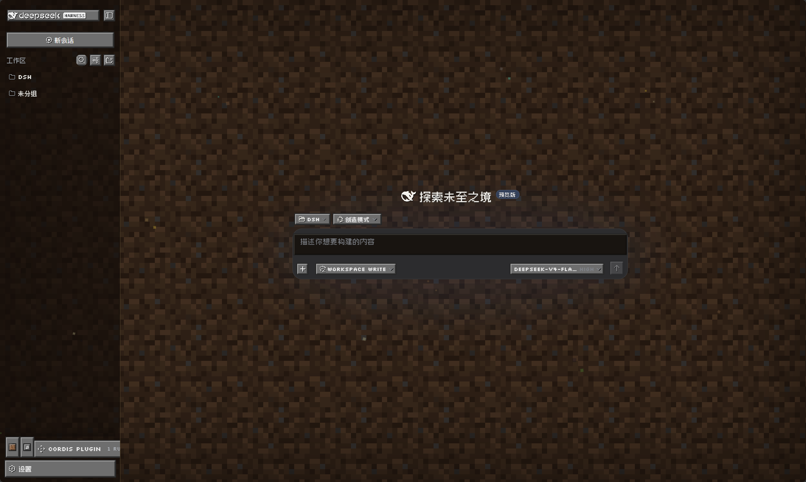
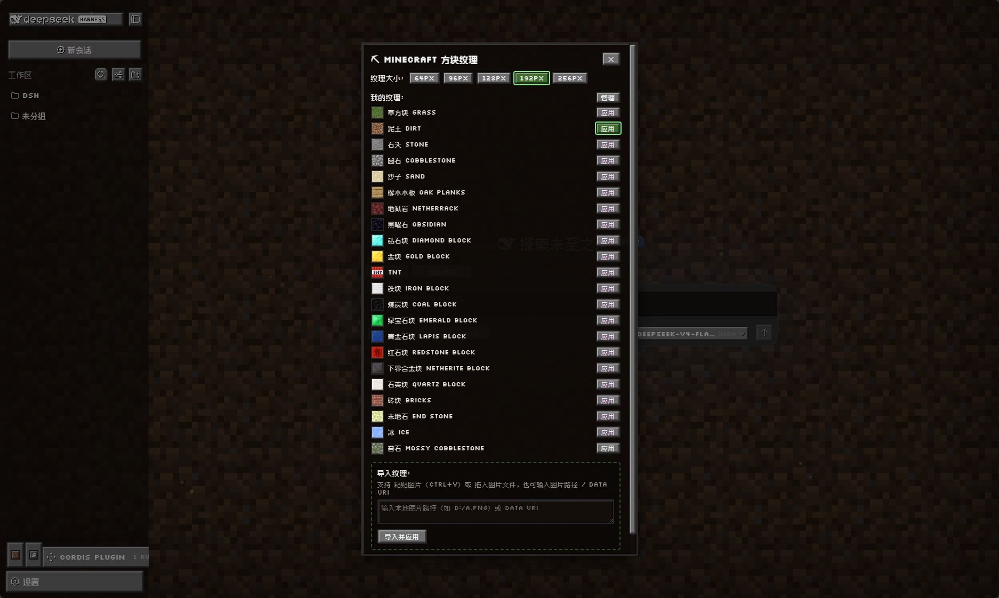
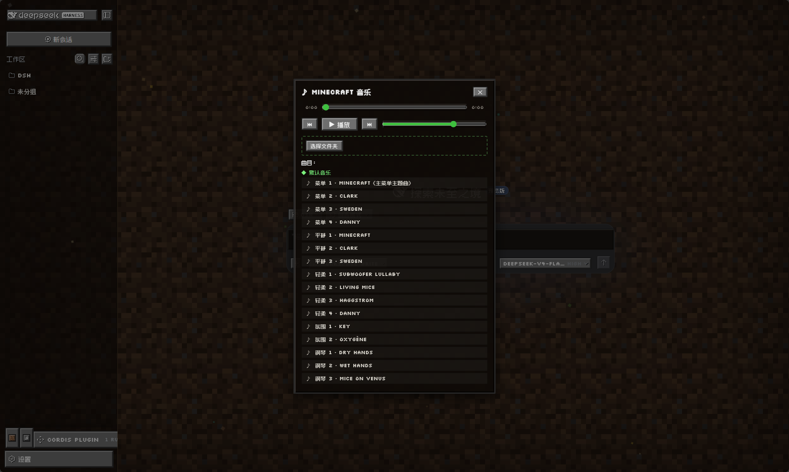

# dsh-minecraft-theme

> Minecraft 主题插件 for [DeepSeek Harness (DSH)](https://github.com/deepseek-ai/dsh)

为 DSH Web 界面铺满 Minecraft 方块纹理背景，并把整个界面改成像素风：
MC 风格灰色按钮、像素字体、按钮点击音效、方块纹理选择/导入/管理，以及内置 Minecraft 原声的**音乐播放器**（支持导入本地音乐文件夹，全程不上传）。


## 截图

| 主题 | 纹理管理 | 音乐播放器 |
| --- | --- | --- |
|  |  |  |

## 功能特性

### 🎨 主题
- **方块纹理背景**：21 种官方 Minecraft 方块纹理（草方块、石头、钻石块、TNT……）平铺铺满页面，可一键切换
- **纹理大小可调**：64 / 96 / 128 / 192 / 256 px
- **气泡纹理**：可为用户消息气泡应用方块纹理（黑曜石、石头、木板、下界合金……），纹理大小可调
- **输入框纹理**：可为输入框大框应用方块纹理，和背景/气泡纹理独立设置
- **文字颜色自定义**：气泡和输入框文字都支持任意色盘选色
- **MC 立体浮雕**：输入框/气泡统一使用 2px 黑边 + 左上高光 + 右下阴影的方块浮雕效果
- **像素字体**：中文（Zpix 像素字体）+ 英文（Silkscreen），全界面生效
- **MC 风格按钮**：灰色浮雕质感按钮，点击播放 Minecraft 官方 `click.ogg` 音效
- **漂浮方块粒子**：装饰元素，可开关

### 🖼 纹理管理
- **我的纹理**统一列表：内置 21 个方块 + 导入/自制的纹理，均可一键应用
- **管理模式**：改名（内置方块也能改）、删除（可恢复）、↑↓ 调整顺序
- **导入纹理**：粘贴图片（Ctrl+V）、拖入图片、输入本地图片路径 / data URI
- **持久化**：自定义纹理、改名、排序保存到本地，重启不丢
- **设置持久化**：背景/气泡/输入框纹理、纹理大小、文字颜色、粒子开关也会自动保存，重启后自动恢复

### 🎵 音乐播放器
- **16 首 Minecraft 官方原声**：菜单（Minecraft 主题曲 / Clark / Sweden / Danny）+ 游戏音乐（Subwoofer Lullaby、Living Mice、Dry Hands……）
- **播放控制**：播放/暂停、上一首/下一首、音量、可拖动进度条、自动连播
- **本地音乐**：选择本地文件夹导入自己的音乐（ogg/mp3/wav/flac，数量不限），直接本地播放、不上传
- **分组列表**：◆ 默认音乐 / ◆ 本地音乐 分开显示
- 内存友好：内置音乐缓存最多 6 首（LRU），本地音乐流式播放

## 安装

```bash
直接在deepseek harness输入：
  安装https://github.com/SuperLS-X/dsh-minecraft-theme
剩下的让他自己来做就行，你只需要点一点同意
```

> 插件是 DSH rc.7 静态插件（static plugin）：主机端通过 `cordis.patch.yml`
> 以 profile bundle 行挂载，浏览器端由 `/plugins/<id>/client.js` 提供。
> 主机端在 `ctx.webServer` 上注册 `/mc/rpc` 路由供浏览器端 fetch 调用，
> 本地资源（纹理/字体/音效/音乐）全部在主机进程内读取，不上传。

> **无需任何本地资源即可完整使用**（在线时）。资源按以下优先级加载：
> 1. 工作区 `<workspace>/mc-textures/`（用户自定义，可覆盖默认资源）
> 2. 包内自带默认资源：`click.ogg` 点击音效、`silkscreen` 英文字体、
>    `dotgothic16` 中文字体（约 410KB，随插件分发）
> 3. CDN 兜底：中文字体 Zpix、16 首 Minecraft 原声音乐
>
> 可选优化（离线或追求最佳效果）：把资源放进工作区——
> - `<workspace>/mc-textures/zpix.ttf`（中文字体，7MB，效果最佳）
> - `<workspace>/mc-textures/music/*.ogg`（默认音乐，避免每次在线拉取）
>
> 自定义纹理与设置保存到工作区 `<workspace>/mc-textures/`：
> - `custom-textures.json`：自定义纹理、改名、排序
> - `theme-settings.json`：背景/气泡/输入框纹理、大小、文字颜色、粒子开关

## 使用

1. 侧边栏底部出现 **纹理**（方块图标）与 **音乐**（♪/♫）两个按钮
2. 点击 **纹理**：切换背景纹理、气泡纹理、输入框纹理，导入/管理自定义纹理，调整纹理大小和文字颜色
3. 点击 **音乐**：选择曲目播放、导入本地音乐文件夹
4. 点击任意按钮都有 MC 点击声；打开纹理面板可调纹理大小、开关粒子

## 目录结构

```
dsh-minecraft-theme/
├── cordis.patch.yml   # 组合补丁：挂载为 profile bundle 行（inject fs/sandboxPolicy/webServer）
├── lib/index.js       # 主机端：/mc/rpc 路由 + 资源读取（工作区 → 包内 → CDN 兜底）
├── client/client.js   # 浏览器端：主题 + 纹理管理 + 音乐播放器（fetch /mc/rpc）
├── mc-textures/       # 包内默认资源：click.ogg / silkscreen / dotgothic16
├── package.json
├── README.md
└── LICENSE
```

## 免责声明

- Minecraft 是 Mojang Studios 的商标；本插件与 Mojang 无关
- 默认音乐/音效/纹理来自 [InventivetalentDev/minecraft-assets](https://github.com/InventivetalentDev/minecraft-assets)（非商业学习用途），相关版权归其所有者
- 包内随插件分发的字体 Silkscreen 与 DotGothic16 采用 SIL OFL 1.1 协议；Zpix（[SolidZORO/zpix-pixel-font](https://github.com/SolidZORO/zpix-pixel-font)）版权归其作者，仅通过 CDN 按需加载，不随包分发

## License

[MIT](LICENSE)
